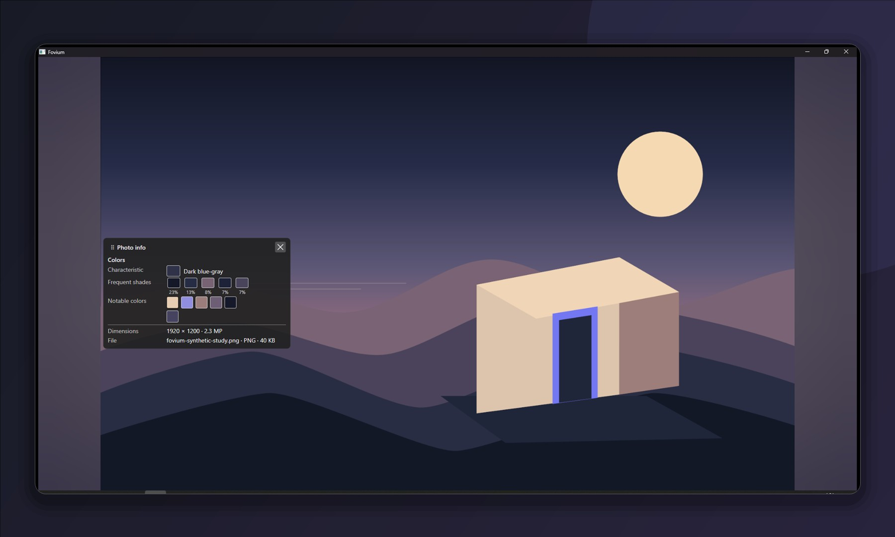

<p align="center">
  
</p>

<h1 align="center">Fovium</h1>

<p align="center"><strong>A photograph-first desktop viewer for fast, faithful presentation and precise inspection.</strong></p>

<p align="center">
  <a href="https://github.com/Samuelishe/Fovium/actions/workflows/ci.yml"></a>
  <a href="https://github.com/Samuelishe/Fovium/actions/workflows/native-libheif.yml"></a>
  <a href="https://github.com/Samuelishe/Fovium/actions/workflows/native-lcms2.yml"></a>
</p>

<p align="center">
  
</p>

Fovium keeps the photograph at the center of the experience: normal viewing has no persistent chrome, while focused
inspection and presentation tools appear only when requested. It is an active alpha project built with C#,
.NET 10, Avalonia, and Skia.

[Read the Project Vision →](docs/PROJECT-VISION.md)

## Highlights

- **View without distraction.** Fast same-directory navigation, cursor-anchored zoom and pan, physical-pixel
  photographic 100%, fullscreen, and a deliberate photographic Stage.
- **Inspect with precision.** Hold-to-view Peek 100% and Blink Compare, source-pixel Color Inspector, RGB Histogram,
  and compact Photo Info with photographic metadata and semantic Color Profile.
- **Present photographs cleanly.** Photo Presentation View, optional Matte and photo-derived backgrounds, timed
  Slideshow, cursor highlight, and temporary image-bound presenter markup.
- **Preserve image meaning.** Orientation and source-profile state survive the imaging boundary; Windows ordinary-SDR
  presentation can use the active monitor ICC profile through the app-local Little CMS runtime.
- **Keep preferences human-readable.** Compact task-based Settings include persistent English, Russian, or system
  language selection, grouped shortcuts, and a useful product/version About surface.

## Platforms and formats

| Platform | Current state                                                                          |
|----------|----------------------------------------------------------------------------------------|
| Windows  | Primary runtime-tested platform; ordinary-SDR monitor color management is available    |
| Linux    | Supported build and CI target; broader desktop/runtime acceptance is still in progress |
| macOS    | Build and CI coverage exists; full runtime acceptance is not yet claimed               |

Fovium currently opens JPEG, PNG, static WebP, bounded static 8-bit TIFF, and—when the optional app-local libheif
runtime is present—bounded static 8-bit SDR HEIF/HEIC and AVIF. Exact codec, alpha, orientation, metadata, and
limitation
details live in the [format support matrix](docs/FORMAT-SUPPORT.md).

## Getting started

Fovium is currently source-built. Install the [.NET 10 SDK](https://dotnet.microsoft.com/download/dotnet/10.0) and
PowerShell 7, then run:

```powershell
git clone https://github.com/Samuelishe/Fovium.git
cd Fovium
dotnet restore Fovium.sln
dotnet build Fovium.sln -c Release --no-restore
dotnet run --project Fovium -c Release --no-build -- "C:\path\to\photo.jpg"
```

Run without a path to open the file picker. Multiple image paths may also be supplied.

<details>
<summary><strong>Optional native capabilities</strong></summary>

The managed solution builds and runs for JPEG, PNG, WebP, and TIFF without prebuilt native artifacts. HEIF/AVIF decode
uses Fovium's reproducible app-local libheif bundle; Windows monitor color management uses the app-local Little CMS
bundle. Neither runtime is downloaded by the application or borrowed from the system.

- [Build the libheif runtime](eng/native/libheif/README.md)
- [Build the Little CMS runtime](eng/native/lcms2/README.md)

</details>

### Essential controls

| Action                                   | Default input                |
|------------------------------------------|------------------------------|
| Open image                               | `Ctrl+O`                     |
| Previous / next image                    | `Left Arrow` / `Right Arrow` |
| Zoom / Fit / photographic 100%           | Wheel or `+` / `-`, `0`, `1` |
| Peek 100%                                | Hold `Z`                     |
| Blink Compare                            | Hold `Shift+C`               |
| Photo Info / Histogram / Color Inspector | `I` / `G` / `K`              |
| Photo Presentation / Slideshow           | `F6` / `F5`                  |
| Fullscreen                               | `F11`                        |

Bindings other than `Esc` are configurable. The complete interaction contract and shortcut set are documented in
[User Experience](docs/UX-CONTRACT.md).

## Documentation

- [Project Vision](docs/PROJECT-VISION.md) — product direction and philosophy
- [User Experience](docs/UX-CONTRACT.md) — interaction and complete controls
- [Format Support](docs/FORMAT-SUPPORT.md) — precise codec scope and limitations
- [Rendering](docs/RENDERING.md) and [Color Management](docs/COLOR-MANAGEMENT.md) — display-quality contracts
- [Project Status](docs/PROJECT-STATE.md) — current implementation truth and open validation boundaries
- [Documentation Index](docs/INDEX.md) — the full technical documentation map

Fovium is under active alpha development. Behavior and internal APIs may change, and there is not yet a packaged
release or installer.

## Development

Run the same managed verification sequence used by CI:

```powershell
dotnet restore Fovium.sln
dotnet build Fovium.sln -c Release --no-restore
dotnet test Fovium.sln -c Release --no-build
```

See [Test Execution](docs/TEST-EXECUTION.md) for focused suites and native-runtime verification. Third-party dependency
and asset provenance is recorded in [Third-Party](docs/THIRD-PARTY.md).

## License

A project license has not been selected yet. Third-party components retain their own licenses and terms.
